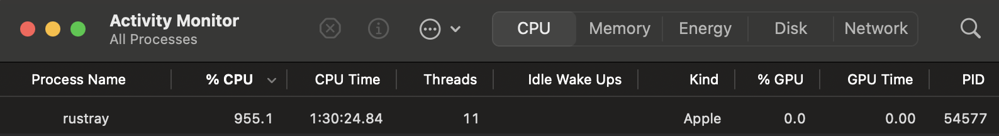
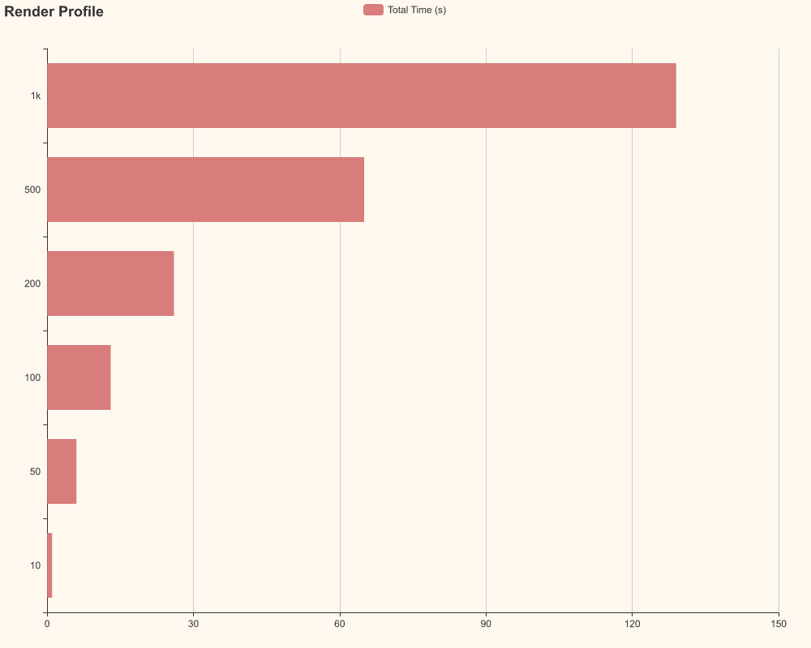

# rustray

A work-in-progress ray tracer following the ["Ray Tracing in One Weekend"](https://raytracing.github.io/) series. Scenes are authored in TOML, loaded into `core::render::Render`, and rendered to PNGs under `samples/`. The library exposes both single-threaded and Rayon-powered renderers and records per-material timing stats.

## Render a scene
- Install the Rust 2024 toolchain.
- Render a TOML scene (defaults to `scenes/bouncing_spheres.toml`, writes `samples/<scene>.png`):

```bash
cargo run --release --bin rustray -- [path/to/scene.toml] [--concurrent]
```

- Omit the path to use the default scene. Pass `--concurrent` to split the image into row chunks per CPU and render in parallel; the default mode runs the single-threaded `raytrace`.

## Profile rendering
- Sweep through several sample-per-pixel counts and generate a timing chart:

```bash
cargo run --release --bin rustray_profile -- [path/to/scene.toml] [--concurrent]
```

- The profiler renders each configured SPP in `src/bin/rustray_profile.rs` (defaults: 10, 50, 100, 200, 500, and 1000), saving `samples/<scene>_<spp>.png`, printing percentiles from the stats tracker, and writing `profile_<scene>.png` using `charming`.

## Scene format
- Scenes round-trip through `core::scene_file::{load_render, save_render}`. The TOML schema includes:
  - Global `width`, `samples`, `depth`, and a serialized `camera` (origin/look vectors, aperture, focal length, aspect ratio, and vertical FOV). Rays carry a random `time` value to support motion blur.
  - `geometries`: tagged entries for `Sphere`, `Quad`, `Cube` (assembled from quads), or `World` (sky gradient).
  - `materials`: tagged entries for `Lambertian`/`Metallic`/`Dielectric`/`DiffuseLight`/`Isotropic`/`World`, with textures `Color`, `Checker`, `Noise`, or `Uv` (uses assets like `assets/earth.jpg`).
  - `objects`: pairs a geometry id with a material id plus optional `transforms` (`Rotate`, `Translate`, `Scale`, `Move` with time range for motion blur) and an optional `albedo` tint applied by `MaterialInstance`.
  - `volumes`: participating media; references a boundary geometry, phase-function material, density, and optional transforms.
- Scenes are deduped by id when serialized, so reused geometry/materials stay shared.

## Project layout
- `src/bin/rustray.rs` — CLI renderer that loads a TOML scene, optionally runs `raytrace_concurrent`, and writes `samples/<scene>.png`.
- `src/bin/rustray_profile.rs` — profiling helper that renders multiple SPPs and emits a timing bar chart.
- `src/lib.rs` — exposes `raytrace` (single-threaded) and `raytrace_concurrent` (Rayon) plus helpers for chunking and assembling scanlines.
- `src/core/` — camera/ray/bbox primitives, BVH (`bvh`), render container (`render`), renderables/objects (`object`), volumes (`volume`), sky gradient (`world`), and TOML scene loader/saver (`scene_file`).
- `src/geometry/` — hittables (sphere, quad, cube), transforms (rotate/translate/scale/move), and `GeometryInstance` that applies transforms and motion blur-aware bounds.
- `src/materials/` — lambertian, metallic, dielectric, diffuse light, isotropic volumes, and `MaterialInstance` for optional albedo tinting; `src/textures/` covers color/checker/Perlin noise/UV textures.
- `src/stats/` — `hdrhistogram`-based tracker plus chart rendering via `charming`.
- `examples/` — programmatic scene builders that mirror the TOML files.
- `samples/` holds rendered outputs; `target/` is build output (do not commit).

## Rendering details
- Pixels are sampled with stratified jitter (`sqrt(spp) x sqrt(spp)` grid). Gamma correction is applied via square root before saving.
- BVH culling (built in `Scene::build_bvh`) sits in front of per-object hit tests; every hittable supplies a bounding box, including transformed/moving instances.
- Rays keep their `time` through scattering to keep motion blur and animated transforms consistent.
- Volumes implement an isotropic phase function; the world background is modeled as a `World` hittable/material pair.

## Common tasks
- Format: `cargo fmt`
- Lint: `cargo clippy -- -D warnings`
- Build: `cargo build`
- Test: `cargo test` (no tests yet)

## Sample renders

### Final scene from "Ray Tracing in One Weekend: The Next Week"

400 boxes, 1,000+ spheres, 1 diffuse light, glass/metal/diffuse/perlin noise/UV mapping materials, movement transformations

[samples/next_week_scene.rs](samples/next_week_scene.rs)<br />
[scenes/next_week_scene.toml](scenes/next_week_scene.toml)
<details>
<summary>Render Stats</summary>

```
Rendering a 800x800 image with 10000 samples per pixel and max depth 40
Rendering Stats:
--------------------------
Total Hits: 14040430595
Total Samples: 9708499866
Stat: scene_hit
  P50: (375ns, 0ns)
  P90: (625ns, 0ns)
  P99: (1.25µs, 0ns)

Stat: lambertian_hit
  P50: (500ns, 0ns)
  P90: (1.375µs, 0ns)
  P99: (3.167µs, 0ns)

Stat: lambertian_sample
  P50: (0ns, 124ns)
  P90: (0ns, 168ns)
  P99: (0ns, 418ns)

Stat: metallic_hit
  P50: (417ns, 0ns)
  P90: (792ns, 0ns)
  P99: (1.417µs, 0ns)

Stat: metallic_sample
  P50: (0ns, 125ns)
  P90: (0ns, 209ns)
  P99: (0ns, 458ns)

Stat: dielectric_hit
  P50: (500ns, 0ns)
  P90: (791ns, 0ns)
  P99: (1.417µs, 0ns)

Stat: dielectric_sample
  P50: (0ns, 84ns)
  P90: (0ns, 166ns)
  P99: (0ns, 168ns)

Stat: diffuse_light_sample
  P50: (0ns, 1ns)
  P90: (0ns, 42ns)
  P99: (0ns, 42ns)

Total Hit Time: 2h 18m 20s 14ms
Total Sample Time: 0h 19m 27s 557ms
--------------------------
Render Wall Time: 5h 20m 14s 456ms
--------------------------
Image saved.
```
</details>


### Final scene from "Ray Tracing in One Weekend" 

- 400+ spheres, glass/metal/diffuse materials

[samples/bouncing_spheres.rs](samples/bouncing_spheres.rs)<br />
[scenes/bouncing_spheres.toml](scenes/bouncing_spheres.toml)

<details>
<summary>Render Stats</summary>

```
Rendering a 1200x2133.3333 image with 1000 samples per pixel and max depth 50 using 10 threads
Rendering Stats:
--------------------------
Total Hits: 1269646788
Total Samples: 1269646788
Stat: scene_hit
  P50: (0ns, 0ns)
  P90: (0ns, 0ns)
  P99: (0ns, 0ns)

Stat: lambertian_hit
  P50: (292ns, 0ns)
  P90: (458ns, 0ns)
  P99: (1µs, 0ns)

Stat: lambertian_sample
  P50: (0ns, 126ns)
  P90: (0ns, 374ns)
  P99: (0ns, 583ns)

Stat: metallic_hit
  P50: (292ns, 0ns)
  P90: (500ns, 0ns)
  P99: (1.042µs, 0ns)

Stat: metallic_sample
  P50: (0ns, 165ns)
  P90: (0ns, 334ns)
  P99: (0ns, 583ns)

Stat: dielectric_hit
  P50: (416ns, 0ns)
  P90: (666ns, 0ns)
  P99: (1.417µs, 0ns)

Stat: dielectric_sample
  P50: (0ns, 125ns)
  P90: (0ns, 168ns)
  P99: (0ns, 375ns)

Stat: diffuse_light_sample
  P50: (0ns, 0ns)
  P90: (0ns, 0ns)
  P99: (0ns, 0ns)

CPU Hit Time (avg over 10 threads): 0h 0m 44s 30ms
CPU Sample Time (avg over 10 threads): 0h 0m 22s 498ms
CPU Total Time (avg over 10 threads): 0h 1m 6s 528ms
--------------------------
Render Wall Time: 0h 2m 46s 502ms
--------------------------
```
</details>


### Cornell Box

[samples/cornell_box.rs](samples/cornell_box.rs)<br />
[scenes/cornell_box.toml](scenes/cornell_box.toml)

<details>
<summary>Render Stats</summary>

```
Rendering a 600x600 image with 10000 samples per pixel and max depth 100 using 10 threads
Rendering Stats:
--------------------------
Total Hits: 19067882489
Total Samples: 19231402237
Stat: scene_hit
  P50: (0ns, 0ns)
  P90: (0ns, 0ns)
  P99: (0ns, 0ns)

Stat: lambertian_hit
  P50: (292ns, 0ns)
  P90: (459ns, 0ns)
  P99: (875ns, 0ns)

Stat: lambertian_sample
  P50: (0ns, 168ns)
  P90: (0ns, 584ns)
  P99: (0ns, 1.126µs)

Stat: metallic_hit
  P50: (0ns, 0ns)
  P90: (0ns, 0ns)
  P99: (0ns, 0ns)

Stat: metallic_sample
  P50: (0ns, 0ns)
  P90: (0ns, 0ns)
  P99: (0ns, 0ns)

Stat: dielectric_hit
  P50: (0ns, 0ns)
  P90: (0ns, 0ns)
  P99: (0ns, 0ns)

Stat: dielectric_sample
  P50: (0ns, 0ns)
  P90: (0ns, 0ns)
  P99: (0ns, 0ns)

Stat: diffuse_light_sample
  P50: (0ns, 41ns)
  P90: (0ns, 42ns)
  P99: (0ns, 42ns)

CPU Hit Time (avg over 10 threads): 0h 10m 34s 938ms
CPU Sample Time (avg over 10 threads): 0h 9m 33s 554ms
CPU Total Time (avg over 10 threads): 0h 20m 8s 492ms
--------------------------
Render Wall Time: 0h 35m 0s 612ms
--------------------------
Image saved to samples/cornell_box.png
```
</details>


## Performance

Concurrent rendering is more efficient on multi-core machines vs. single threaded rendering, however in both methods the render time grows exponentially with pixels-per-sample, max depth, and scene complexity (number of objects, types of materials, etc).

Melt your CPU rendering pretty things.


### Concurrent (10 threads)

Profiling render [scenes/bouncing_spheres.toml](scenes/bouncing_spheres.toml) at 10, 100, 200, 500, and 1000 samples-per-pixel.



### Single-threaded

Profiling render [scenes/bouncing_spheres.toml](scenes/bouncing_spheres.toml) at 10, 100, 200, 500, and 1000 samples-per-pixel.


