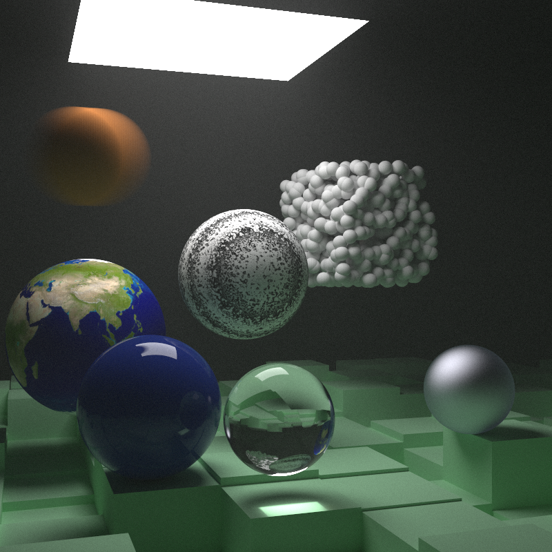
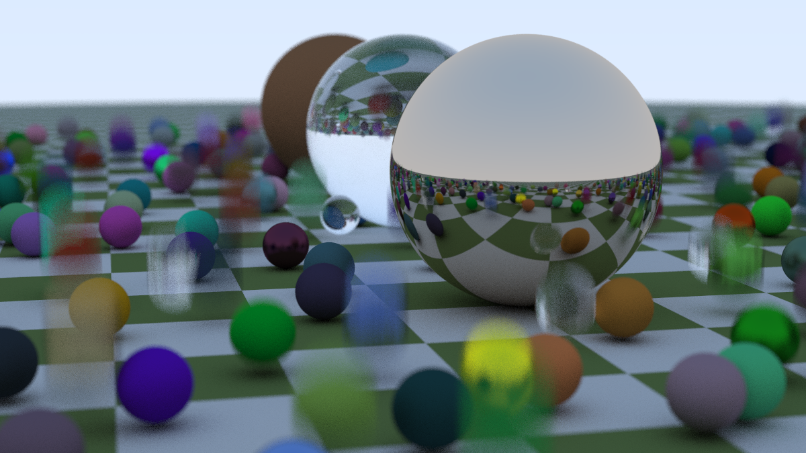
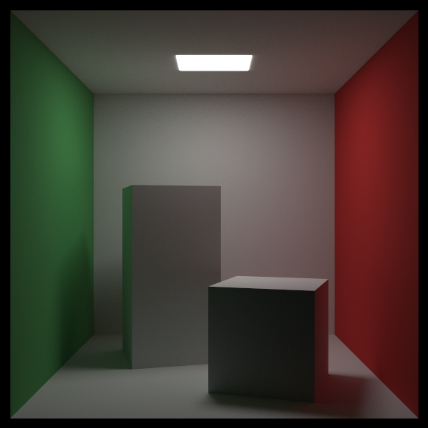
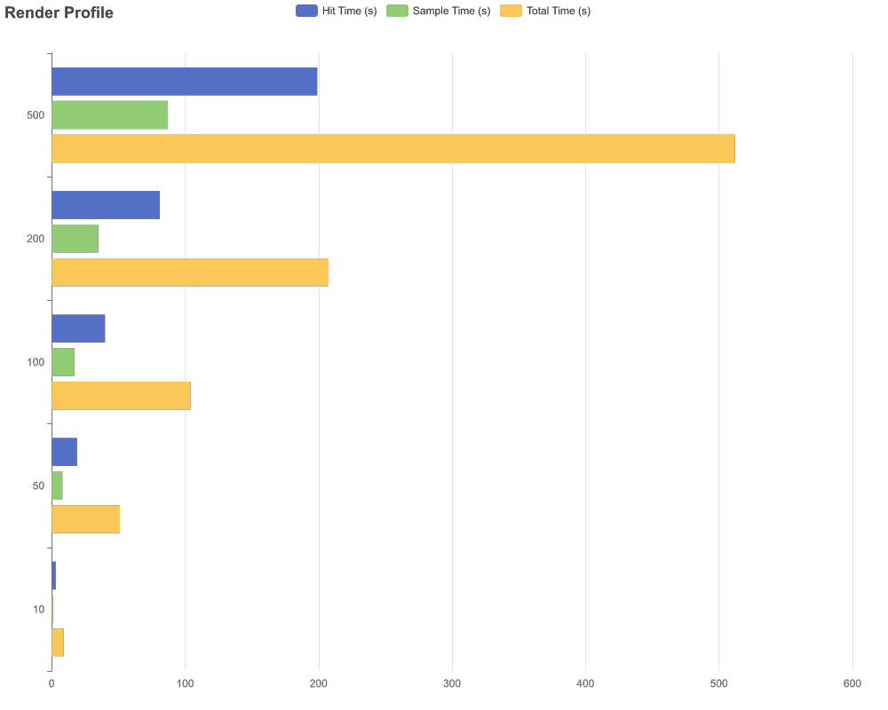

# rustray

A work-in-progress ray tracer following the ["Ray Tracing in One Weekend"](https://raytracing.github.io/) series, written while learning Rust. Scenes are described in TOML and rendered to PNGs in `samples/`.

[samples/next_week_scene.rs](samples/next_week_scene.rs)<br />
[scenes/next_week_scene.toml](scenes/next_week_scene.toml)
<details>
<summary>Render Stats</summary>

```
Rendering a 800x800 image with 10000 samples per pixel and max depth 40
Rendering Stats:
--------------------------
Total Hits: 14040430595
Total Samples: 9708499866
Stat: scene_hit
  P50: (375ns, 0ns)
  P90: (625ns, 0ns)
  P99: (1.25µs, 0ns)

Stat: lambertian_hit
  P50: (500ns, 0ns)
  P90: (1.375µs, 0ns)
  P99: (3.167µs, 0ns)

Stat: lambertian_sample
  P50: (0ns, 124ns)
  P90: (0ns, 168ns)
  P99: (0ns, 418ns)

Stat: metallic_hit
  P50: (417ns, 0ns)
  P90: (792ns, 0ns)
  P99: (1.417µs, 0ns)

Stat: metallic_sample
  P50: (0ns, 125ns)
  P90: (0ns, 209ns)
  P99: (0ns, 458ns)

Stat: dielectric_hit
  P50: (500ns, 0ns)
  P90: (791ns, 0ns)
  P99: (1.417µs, 0ns)

Stat: dielectric_sample
  P50: (0ns, 84ns)
  P90: (0ns, 166ns)
  P99: (0ns, 168ns)

Stat: diffuse_light_sample
  P50: (0ns, 1ns)
  P90: (0ns, 42ns)
  P99: (0ns, 42ns)

Total Hit Time: 2h 18m 20s 14ms
Total Sample Time: 0h 19m 27s 557ms
--------------------------
Render Wall Time: 5h 20m 14s 456ms
--------------------------
Image saved.
```
</details>



[samples/bouncing_spheres.rs](samples/bouncing_spheres.rs)<br />
[scenes/bouncing_spheres.toml](scenes/bouncing_spheres.toml)

<details>
<summary>Render Stats</summary>

```
Rendering a 1200x2133.3333 image with 100 samples per pixel and max depth 50
Rendering Stats:
--------------------------
Total Hits: 213108951
Total Samples: 132108951
Stat: scene_hit
  P50: (375ns, 0ns)
  P90: (583ns, 0ns)
  P99: (750ns, 0ns)

Stat: lambertian_hit
  P50: (291ns, 0ns)
  P90: (416ns, 0ns)
  P99: (667ns, 0ns)

Stat: lambertian_sample
  P50: (0ns, 125ns)
  P90: (0ns, 168ns)
  P99: (0ns, 417ns)

Stat: metallic_hit
  P50: (291ns, 0ns)
  P90: (417ns, 0ns)
  P99: (792ns, 0ns)

Stat: metallic_sample
  P50: (0ns, 125ns)
  P90: (0ns, 208ns)
  P99: (0ns, 458ns)

Stat: dielectric_hit
  P50: (375ns, 0ns)
  P90: (584ns, 0ns)
  P99: (916ns, 0ns)

Stat: dielectric_sample
  P50: (0ns, 84ns)
  P90: (0ns, 166ns)
  P99: (0ns, 168ns)

Stat: diffuse_light_sample
  P50: (0ns, 0ns)
  P90: (0ns, 0ns)
  P99: (0ns, 0ns)

Total Hit Time: 0h 1m 10s 841ms
Total Sample Time: 0h 0m 17s 152ms
--------------------------
Render Wall Time: 0h 1m 47s 403ms
--------------------------
Image saved to samples/bouncing_spheres.png
```
</details>



[samples/cornell_box.rs](samples/cornell_box.rs)<br />
[scenes/cornell_box.toml](scenes/cornell_box.toml)

<details>
<summary>Render Stats</summary>

```
Rendering a 600x600 image with 1000 samples per pixel and max depth 100
Rendering Stats:
--------------------------
Total Hits: 2146598937
Total Samples: 1848107396
Stat: scene_hit
  P50: (125ns, 0ns)
  P90: (208ns, 0ns)
  P99: (250ns, 0ns)

Stat: lambertian_hit
  P50: (208ns, 0ns)
  P90: (292ns, 0ns)
  P99: (375ns, 0ns)

Stat: lambertian_sample
  P50: (0ns, 84ns)
  P90: (0ns, 168ns)
  P99: (0ns, 417ns)

Stat: metallic_hit
  P50: (0ns, 0ns)
  P90: (0ns, 0ns)
  P99: (0ns, 0ns)

Stat: metallic_sample
  P50: (0ns, 0ns)
  P90: (0ns, 0ns)
  P99: (0ns, 0ns)

Stat: dielectric_hit
  P50: (0ns, 0ns)
  P90: (0ns, 0ns)
  P99: (0ns, 0ns)

Stat: dielectric_sample
  P50: (0ns, 0ns)
  P90: (0ns, 0ns)
  P99: (0ns, 0ns)

Stat: diffuse_light_sample
  P50: (0ns, 1ns)
  P90: (0ns, 42ns)
  P99: (0ns, 42ns)

Total Hit Time: 0h 6m 49s 812ms
Total Sample Time: 0h 3m 50s 750ms
--------------------------
Render Wall Time: 0h 13m 52s 956ms
--------------------------
Image saved to samples/cornell_box.png
```
</details>



## Quick start
- Install the Rust toolchain (2024 edition).
- Render a scene (defaults to `scenes/bouncing_spheres.toml`, writes `samples/bouncing_spheres.png`):

```bash
cargo run --release [path/to/scene.toml]
```

## Project layout
- `src/main.rs` — binary entry point; loads a TOML scene file and hands it to `raytrace`, then writes `samples/<scene>.png`.
- `src/lib.rs` — exposes the `raytrace` loop (takes a `&mut rand::rngs::ThreadRng` and a `core::render::Render`) and prints timing stats.
- `src/core/` — camera/ray/bbox primitives, BVH, sky gradient (`world`), render container, scene loading/saving (`scene_file`), and renderable plumbing.
- `src/geometry/` — hittable primitives (sphere, quad, cube assembled from quads), transform definitions, and an instance wrapper that applies transforms/motion blur.
- `src/materials/` — scattering: lambertian, metallic, dielectric, diffuse light plus `MaterialInstance` for albedo tinting; `src/textures/` holds color/checker/perlin/UV textures.
- `src/traits/` — `Hittable`, `Renderable`, `Sampleable`, and `Texturable` traits; math helpers live in `src/math/`; render timing is in `src/stats.rs`.

## Scenes and composition
- Scenes live in `scenes/*.toml` and round-trip through `core::scene_file`. Each scene specifies output width, samples per pixel, max depth, camera, and a list of geometries/materials.
- Objects pair a geometry (`GeometryInstance` wraps a hittable with transforms such as translate/rotate/scale/move) with a material (`MaterialInstance` wraps a sampleable with optional albedo).
- Available geometry: spheres, quads, cubes (built from six quads), and the infinite sky `world`. Materials include lambertian, metallic, dielectric, and diffuse light; textures include solid color, checker, noise, and UV images.

## Common tasks
- Format: `cargo fmt`
- Lint: `cargo clippy -- -D warnings`
- Build: `cargo build`
- Render: `cargo run --release scenes/bouncing_spheres.toml`

## Extending the renderer
- Add geometry by implementing `Hittable` under `src/geometry/` (include a bounding box so BVH culling works).
- Add materials by implementing `Sampleable` under `src/materials/` and textures via `Texturable` under `src/textures/`.
- Pair them with `core::object::RenderObject` and add to a `Scene` (or the TOML format) to render new objects.

## Performance

Render times scale exponentially with samples-per-pixel and max depth, with overall render times scaling non-linearly with hit/sample time.


