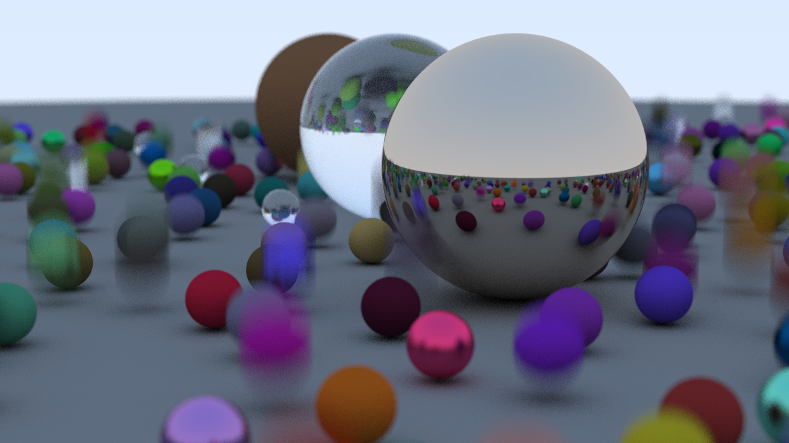

# rustray

A work-in-progress ray tracer written in while learning Rust.



```

```

## Quick start
- Install the Rust toolchain (2024 edition).
- Render the default scene (1200px wide, 16:9 aspect, 100 samples per pixel, max depth 50):

```bash
cargo run --release
```

## Project layout
- `src/main.rs` — binary entry point that wires the camera, scene objects (including motion-blurred spheres), and materials together, then writes a PNG.
- `src/lib.rs` — exposes the `raytrace` function used by the binary; accepts a caller-supplied `&mut rand::rngs::ThreadRng` and prints timing stats.
- `src/core/` — math and camera primitives (`vec`, `ray`, `camera`, `interval`, `bbox`, `scene`).
- `src/materials/` — scattering logic for diffuse, metallic, and dielectric surfaces.
- `src/primitives/` — hittable geometry such as spheres (static or moving) and the skybox background.
- `src/traits/` — `Hittable`, `Sampleable`, and `Renderable` traits plus the `RenderableList` glue that pairs geometry with materials.
- `src/utils/stats.rs` — lightweight render timing aggregation.

## Common tasks
- Format: `cargo fmt`
- Lint: `cargo clippy -- -D warnings`
- Build: `cargo build`
- Render: `cargo run --release` (produces `output.png`)

## Adjusting renders
- Resolution and sampling: edit `nx`, `ns`, and `max_depth` near the top of `src/main.rs` (height is derived from `nx` and aspect ratio).
- Scene contents: the same file builds the scene by pairing primitives (e.g., `Sphere`, `Skybox`) with materials (`Diffuse`, `Metallic`, `Dielectric`) via `renderable::create_renderable`.
- Camera: tweak `CameraConfig` in `src/main.rs` or construct your own via `Camera::with_config`.

## Extending the renderer
- Add geometry by implementing `Hittable` under `src/primitives/`.
- Add materials by implementing `Sampleable` under `src/materials/`.
- Compose them with `renderable::create_renderable` and add to `Scene` to render new objects.
